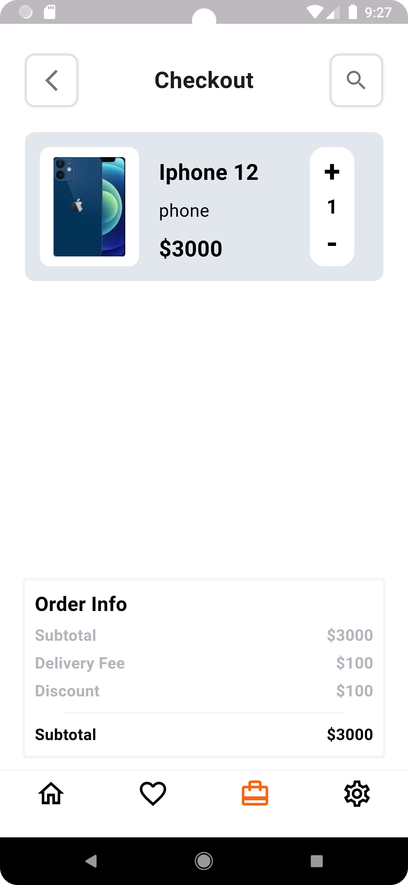
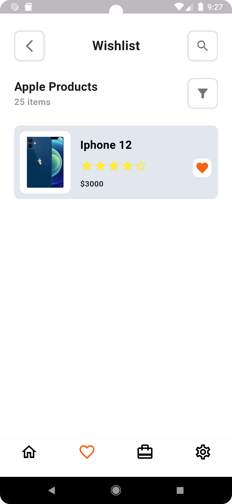
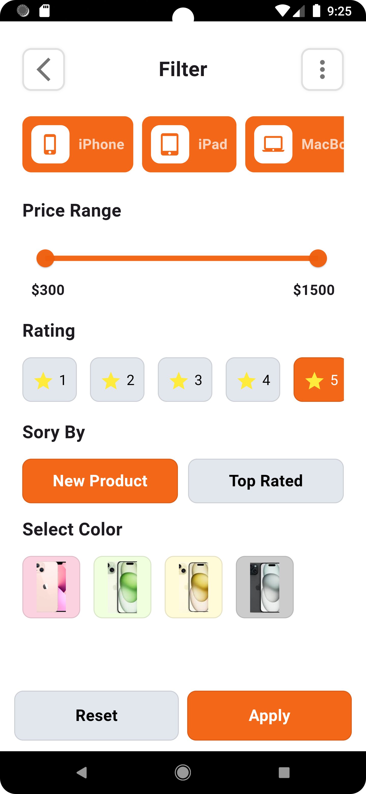
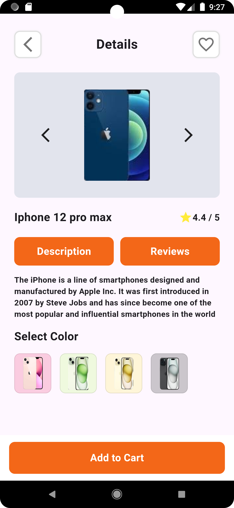
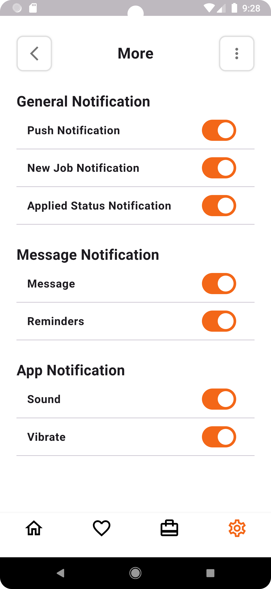
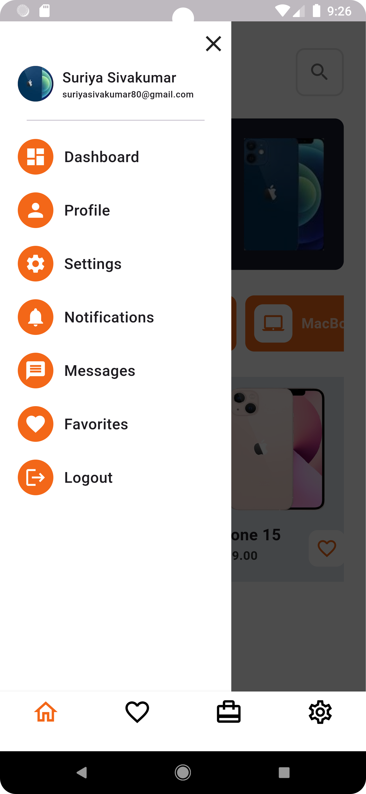

📱 Online Apple Store – Flutter UI Design
A sleek and modern Online Apple Store UI built with Flutter, inspired by Apple's minimalistic design. This project showcases a clean, responsive, and high-performance shopping experience for iPhone lovers.

✨ Features:
✅ Clean UI – Inspired by Apple’s design aesthetics
✅ Responsive Layout – Optimized for all screen sizes
✅ Flutter & Dart – Ensuring fast performance

💡 Feel free to fork, star ⭐, and contribute!

#Flutter #UIDesign #Dart #MobileApp #Ecommerce #AppleStore

## 📸 Screenshots

### 🏠 Home Screen

### 🛒 Cart Screen

### ⭐ Favorite Screen

### 🔍 Filter Screen

### 📄 Product Detail Screen

### ⚙️ Settings Screen

### 📂 Side Menu

